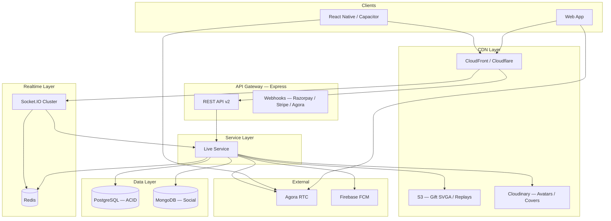
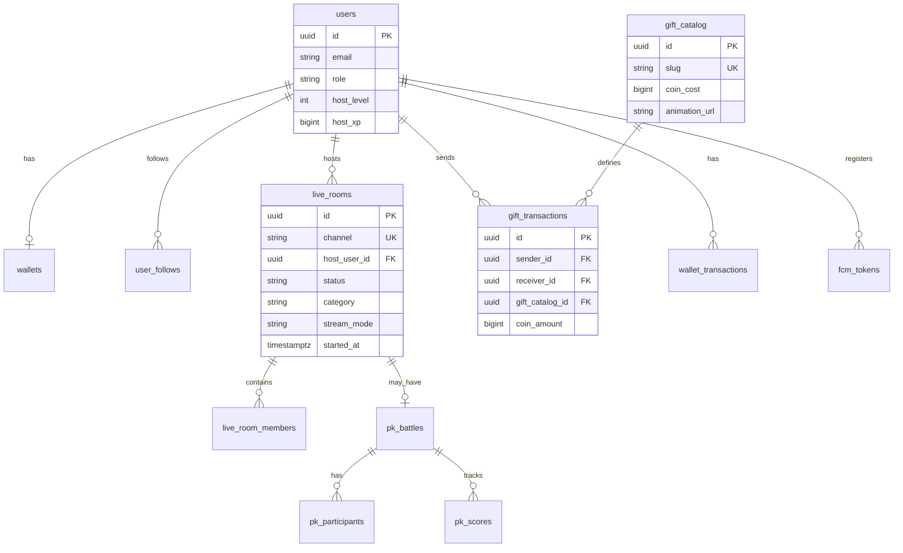
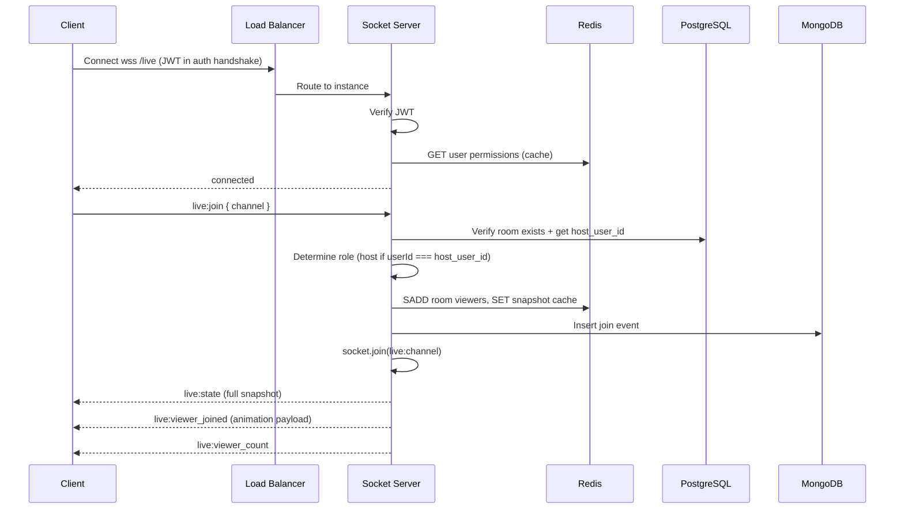
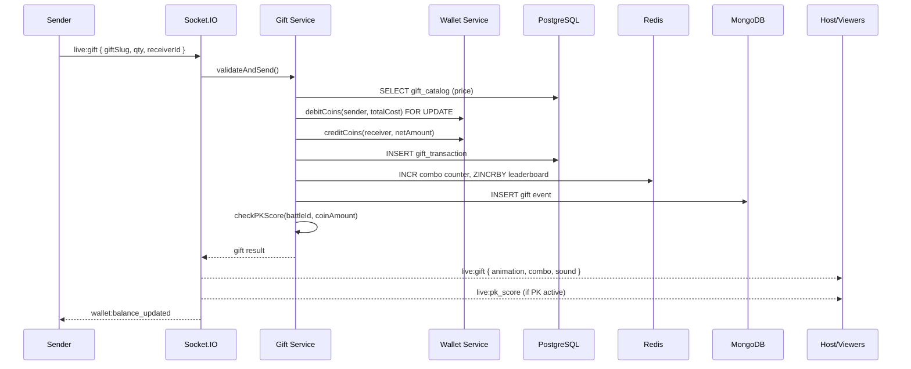
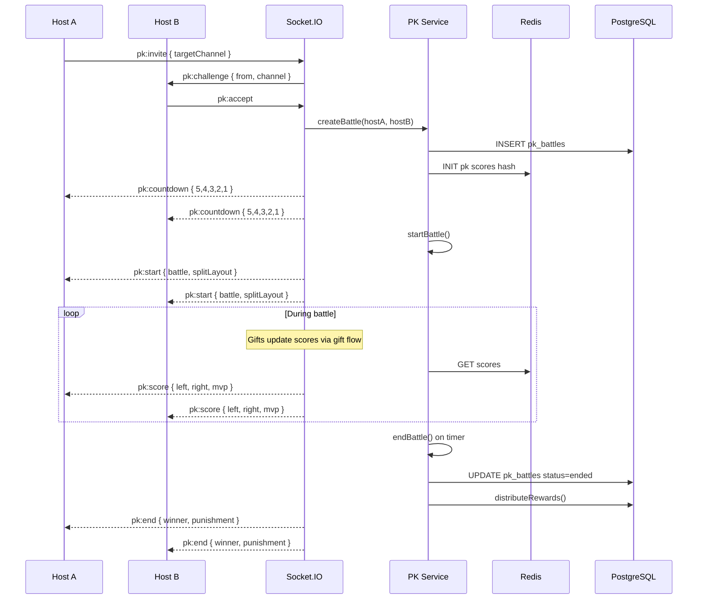
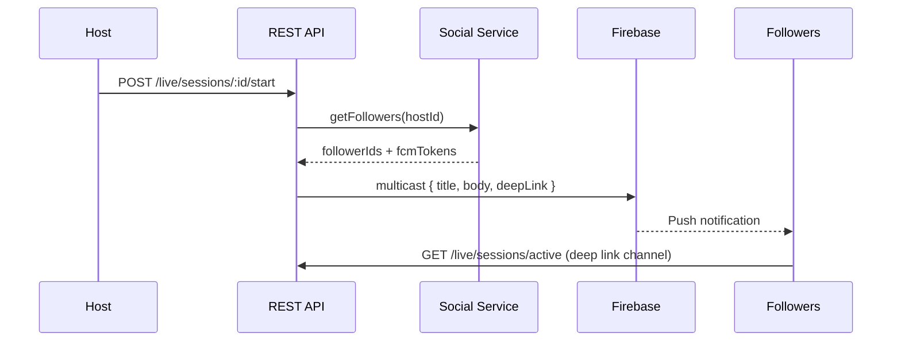
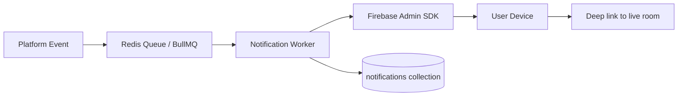
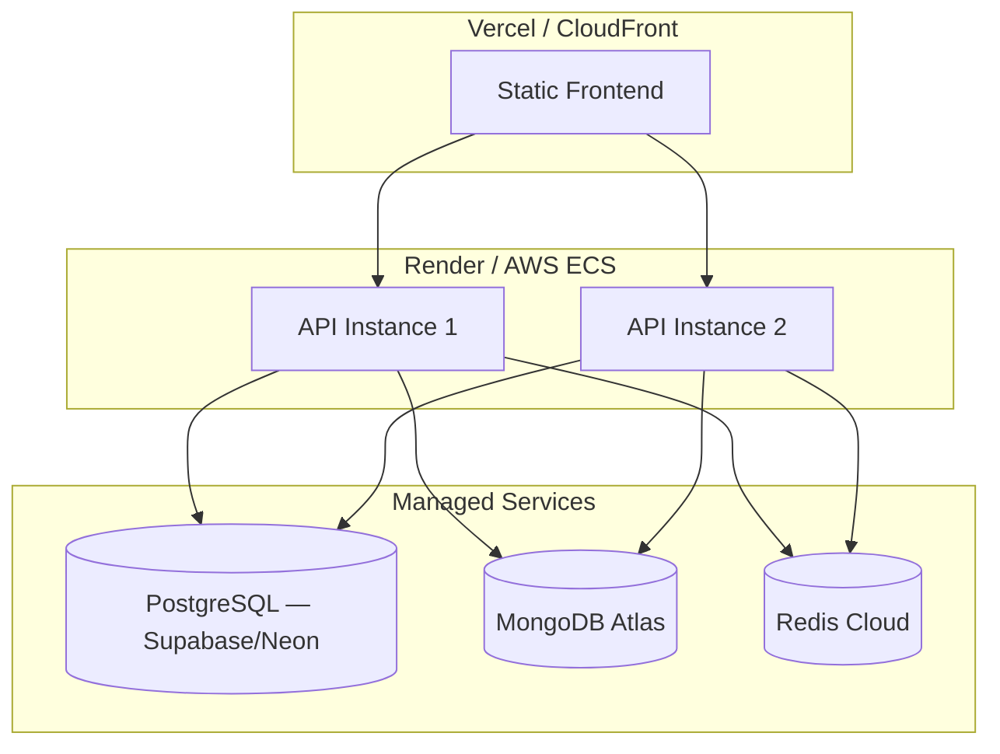

# System Architecture — Production Live Streaming Platform

**Version:** 2.0 (Rebuild Proposal)  
**Date:** 2026-06-12  
**Status:** Design only — awaiting approval before implementation  
**Stack:** Node.js, Express, MongoDB, Redis, Socket.IO, Agora SDK, Cloudinary, AWS S3, Firebase Cloud Messaging

---

## 1. Current State vs Target State

| Aspect | Current | Target |
|--------|---------|--------|
| Primary DB | PostgreSQL (authoritative) | **Hybrid:** PostgreSQL (ACID) + MongoDB (high-write social) |
| Caching | Optional Redis, underused | Redis required (presence, rooms, rate limits) |
| Sockets | Single process, no adapter | Redis adapter, namespaced |
| RTC | Agora optional/mock | Agora required, no silent fallback |
| Storage | Cloudinary partial | Cloudinary (images) + S3 (gift assets, replays) |
| Push | None | FCM |
| Frontend | Monolithic vanilla JS | Modular ES modules → build step |
| Social graph | localStorage | MongoDB + Redis cache |

### Migration principle

**Do not throw away PostgreSQL wallet/RBAC schema.** It is production-quality. MongoDB absorbs high-velocity social data; PostgreSQL retains money and identity.

---

## 2. High-Level Architecture



---

## 3. Database Architecture

### 3.1 PostgreSQL (retain — source of truth for money & identity)

**Tables to keep unchanged:**
- `users`, `wallets`, `wallet_transactions`
- `recharges`, `withdrawals`, `gift_transactions`
- `roles`, `permissions`, `user_roles`
- `agencies`, `agency_members`, `agency_commissions`
- `payment_intents`, `vip_levels`, `vip_memberships`
- `creator_verifications`, `fraud_flags`, `audit_logs`

**Tables to extend:**

```sql
-- Server-authoritative live sessions
ALTER TABLE live_rooms ADD COLUMN IF NOT EXISTS
  category VARCHAR(50),
  cover_url TEXT,
  stream_mode VARCHAR(20) DEFAULT 'video', -- video | audio
  agora_channel VARCHAR(64),
  quality_tier VARCHAR(20) DEFAULT 'hd',
  ended_reason VARCHAR(50);

-- Gift catalog (move price authority to server)
CREATE TABLE gift_catalog (
  id UUID PRIMARY KEY DEFAULT gen_random_uuid(),
  slug VARCHAR(50) UNIQUE NOT NULL,
  name VARCHAR(100) NOT NULL,
  coin_cost BIGINT NOT NULL,
  category VARCHAR(30) NOT NULL,
  animation_url TEXT,          -- S3 SVGA/Lottie path
  animation_type VARCHAR(20),  -- svga | lottie | mp4
  sound_url TEXT,
  is_combo_eligible BOOLEAN DEFAULT true,
  is_lucky BOOLEAN DEFAULT false,
  lucky_config JSONB,
  is_active BOOLEAN DEFAULT true,
  sort_order INT DEFAULT 0,
  created_at TIMESTAMPTZ DEFAULT NOW()
);

-- Social graph (could also live in MongoDB; PG for consistency with wallet)
CREATE TABLE user_follows (
  follower_id UUID REFERENCES users(id),
  following_id UUID REFERENCES users(id),
  created_at TIMESTAMPTZ DEFAULT NOW(),
  PRIMARY KEY (follower_id, following_id)
);

CREATE TABLE user_blocks (
  blocker_id UUID REFERENCES users(id),
  blocked_id UUID REFERENCES users(id),
  created_at TIMESTAMPTZ DEFAULT NOW(),
  PRIMARY KEY (blocker_id, blocked_id)
);
```

### 3.2 MongoDB (new — high-velocity social data)

| Collection | Purpose | Indexes |
|------------|---------|---------|
| `live_chat_messages` | In-room chat (TTL 7 days) | `{ roomId, createdAt }`, `{ roomId, pinned }` |
| `live_room_presence` | Ephemeral viewer state | `{ roomId, userId }` unique |
| `live_events` | Join/leave/gift/reaction event stream | `{ roomId, ts }` TTL |
| `notifications` | In-app notification queue | `{ userId, read, createdAt }` |
| `gift_combos` | Active combo state per sender/room | `{ roomId, senderId }` TTL 30s |
| `moderation_logs` | Chat deletes, kicks, bans | `{ roomId, ts }` |
| `creator_analytics` | Aggregated daily stats | `{ userId, date }` unique |
| `fcm_tokens` | Device push tokens | `{ userId, token }` unique |

**Why MongoDB for chat:** Bigo-class platforms generate thousands of messages per minute per popular room. PostgreSQL `live_room_events` JSONB append does not scale for chat pagination. MongoDB with TTL keeps hot data fast and auto-archives.

### 3.3 Redis (required — not optional)

| Key pattern | Type | TTL | Purpose |
|-------------|------|-----|---------|
| `room:{channel}:snapshot` | Hash | 30s | Hot room state cache |
| `room:{channel}:viewers` | Set | — | Unique viewer socket IDs |
| `room:{channel}:viewers:count` | String | — | Denormalized count |
| `user:{id}:permissions` | Set | 5m | RBAC cache |
| `ratelimit:{userId}:{action}` | String | sliding | Chat/gift rate limits |
| `pk:{battleId}:scores` | Hash | battle duration | Real-time PK scores |
| `leaderboard:daily:gifts` | Sorted Set | 25h | Daily gift ranking |
| `leaderboard:weekly:gifts` | Sorted Set | 8d | Weekly gift ranking |
| `live:active_channels` | Sorted Set | — | Discovery by viewer count |
| `gift:combo:{roomId}:{userId}` | Hash | 30s | Combo multiplier state |
| `socket:user:{userId}` | Set | — | Socket IDs for direct emit |

### 3.4 Database diagram (ER — core domains)



---

## 4. Socket Architecture

### 4.1 Namespace design

| Namespace | Auth | Purpose |
|-----------|------|---------|
| `/live` | JWT required | Room join, chat, gifts, seats, moderation |
| `/pk` | JWT required | PK battle lifecycle |
| `/chat` | JWT required | DM conversations (migrate from default) |
| `/presence` | JWT required | Online status, go-live notifications |

### 4.2 Connection flow



### 4.3 Event catalog — `/live` namespace

| Event | Direction | Payload | Server action |
|-------|-----------|---------|---------------|
| `live:join` | C→S | `{ channel }` | Verify room, assign role from DB, cache presence |
| `live:state` | S→C | Full snapshot | — |
| `live:leave` | C→S | `{ channel }` | Remove presence, emit leave animation |
| `live:chat` | C→S | `{ text, replyTo? }` | Rate limit, persist MongoDB, broadcast |
| `live:chat` | S→C | Message + badges | — |
| `live:reaction` | C→S | `{ type }` | Broadcast ephemeral reaction |
| `live:gift` | C→S | `{ giftSlug, qty, receiverId }` | Validate catalog price, debit wallet, animate |
| `live:gift` | S→C | Gift event + combo + PK score | — |
| `live:seat:request` | C→S | — | Queue in Redis |
| `live:seat:accept` | S→C (host) | `{ userId }` | Host only (DB verified) |
| `live:seat:leave` | C→S | — | Demote to viewer |
| `live:mute` | C→S | `{ userId }` | Host/mod only |
| `live:kick` | C→S | `{ userId }` | Host/mod only |
| `live:pin` | C→S | `{ messageId }` | Host/mod only |
| `live:end` | C→S | — | Host only (DB verified) |
| `live:ended` | S→C | `{ reason }` | — |
| `live:quality` | S→C | `{ networkQuality }` | From Agora callback relay |

### 4.4 Host authority (non-negotiable)

```javascript
// Pseudocode — every privileged action
async function assertHostOrMod(socket, channel) {
  const room = await redis.get(`room:${channel}:snapshot`) 
    || await liveService.getRoom(channel);
  if (room.host_user_id === socket.userId) return 'host';
  if (await modService.isModerator(room.id, socket.userId)) return 'mod';
  throw new ForbiddenError('Not authorized');
}
// NEVER read isHost from client payload
```

### 4.5 Scaling configuration

```javascript
// server.js (target)
const { createAdapter } = require('@socket.io/redis-adapter');
const { createClient } = require('redis');

const pubClient = createClient({ url: process.env.REDIS_URL });
const subClient = pubClient.duplicate();
io.adapter(createAdapter(pubClient, subClient));
```

**Target capacity:** 10,000+ concurrent sockets per 2-instance cluster; 1,000+ active live rooms.

---

## 5. API Architecture

### 5.1 Versioning

| Version | Status | Purpose |
|---------|--------|---------|
| `/api/*` | Legacy (maintain) | Marketplace bookings, workers |
| `/api/v1/*` | Fix or deprecate | Phase 2 (broken `req.userId` bug) |
| `/api/v2/*` | **New** | Live platform REST |

### 5.2 REST endpoints — `/api/v2`

#### Live

| Method | Path | Description |
|--------|------|-------------|
| POST | `/live/sessions` | Create session (title, category, mode) |
| POST | `/live/sessions/:id/start` | Start broadcast (returns Agora token) |
| POST | `/live/sessions/:id/end` | End broadcast |
| GET | `/live/sessions/active` | Discovery feed (paginated, filtered) |
| GET | `/live/sessions/:channel` | Room snapshot (reconnect hydration) |
| GET | `/live/sessions/:channel/members` | Online members with roles |
| POST | `/live/sessions/:channel/moderators` | Add moderator |

#### Agora

| Method | Path | Description |
|--------|------|-------------|
| POST | `/live/agora/token` | Token scoped to channel + role; validates room membership |
| GET | `/live/agora/config` | App ID only (public) |

#### Gifts

| Method | Path | Description |
|--------|------|-------------|
| GET | `/gifts/catalog` | Full catalog with animation URLs |
| GET | `/gifts/catalog/:slug` | Single gift detail |
| GET | `/gifts/leaderboard/daily` | Daily ranking |
| GET | `/gifts/leaderboard/weekly` | Weekly ranking |
| GET | `/gifts/history/:userId` | Gift wall for profile |

#### Social

| Method | Path | Description |
|--------|------|-------------|
| POST | `/social/follow/:userId` | Follow |
| DELETE | `/social/follow/:userId` | Unfollow |
| GET | `/social/followers/:userId` | Follower list |
| GET | `/social/following/:userId` | Following list |
| POST | `/social/block/:userId` | Block |
| GET | `/social/suggestions` | Suggested creators |

#### Wallet (extend existing `/api/wallet`)

| Method | Path | Description |
|--------|------|-------------|
| GET | `/wallet/earnings` | Creator earnings breakdown |
| GET | `/wallet/earnings/live` | Live-specific revenue |

#### PK

| Method | Path | Description |
|--------|------|-------------|
| POST | `/pk/invite` | Send PK challenge |
| POST | `/pk/accept` | Accept challenge |
| GET | `/pk/:channel/active` | Active battle snapshot |
| GET | `/pk/history/:userId` | PK win/loss record |

#### Notifications

| Method | Path | Description |
|--------|------|-------------|
| POST | `/notifications/fcm/register` | Register device token |
| GET | `/notifications` | In-app notifications |

### 5.3 API response envelope

```json
{
  "ok": true,
  "data": { },
  "meta": { "page": 1, "total": 100 },
  "requestId": "uuid"
}
```

### 5.4 Authentication

- REST: `Authorization: Bearer <JWT>`
- Socket: `auth: { token }` in handshake only (remove query string token)
- Agora token: scoped to `channel + uid + role + expiry`; issued only if user is room member

---

## 6. Event Flow Diagrams

### 6.1 Gift send flow



### 6.2 PK battle flow



### 6.3 Go-live notification flow



---

## 7. Streaming Architecture (Agora)

### 7.1 Channel naming

```
live-{roomId}           # Video live
party-{roomId}          # Audio room
pk-{battleId}           # PK composite (or dual channels)
```

### 7.2 Role mapping

| User role | Agora role | Publish |
|-----------|------------|---------|
| Host | `host` | Video + audio |
| Co-host / speaker | `host` | Audio (or video) |
| Viewer | `audience` | None |
| PK participant | `host` | Video + audio |

### 7.3 Token policy

- Tokens expire in 1 hour with silent renewal 5 minutes before expiry
- Token endpoint validates: user is member of room, room is active, user role matches requested publish role
- **No mock mode in production** — if Agora env vars missing, `POST /live/sessions/:id/start` returns 503

### 7.4 Quality monitoring

- Client reports `network-quality` via Agora SDK callback
- Relay to room via `live:quality` socket event
- Host sees indicator; viewers see badge if host quality drops

### 7.5 Recording (future)

- Agora Cloud Recording → S3 bucket `ap-live-replays/{roomId}/{timestamp}.mp4`
- Replay metadata in PostgreSQL `live_rooms.replay_url`

---

## 8. Storage Architecture

| Asset type | Store | Path pattern |
|------------|-------|--------------|
| User avatars | Cloudinary | `ap/users/{userId}/avatar` |
| Live covers | Cloudinary | `ap/live/covers/{roomId}` |
| Gift SVGA/Lottie | S3 + CloudFront | `gifts/{slug}/animation.svga` |
| Gift sounds | S3 | `gifts/{slug}/sound.mp3` |
| Chat images | Cloudinary | `ap/chat/{conversationId}/{msgId}` |
| Withdrawal QR | Cloudinary | `ap/withdrawals/{userId}/{id}` |
| Live replays | S3 | `replays/{roomId}/{timestamp}.mp4` |

### Gift animation pipeline

1. Design exports SVGA/Lottie
2. Upload to S3 via admin panel
3. `gift_catalog.animation_url` points to CDN URL
4. Client preloads top-N popular gifts on room join
5. Player: `svgaplayerweb` or `lottie-web` with alpha channel support

---

## 9. Notification Architecture (FCM)



**Notification triggers:**
- Followed host goes live
- PK challenge received
- Gift received (threshold configurable)
- Withdrawal approved/rejected
- VIP level up
- Moderator action

---

## 10. Folder Structure (Target)

```
backend/
├── server.js                    # Bootstrap, adapter, namespaces
├── config/
│   ├── database.js              # PostgreSQL pool
│   ├── mongodb.js               # MongoDB connection (required)
│   ├── redis.js                 # Redis client (required)
│   ├── agora.js                 # Agora credentials
│   ├── fcm.js                   # Firebase admin
│   └── env.js                   # Validated env schema
├── api/
│   ├── v2/
│   │   ├── routes/
│   │   │   ├── live.routes.js
│   │   │   ├── gifts.routes.js
│   │   │   ├── social.routes.js
│   │   │   ├── pk.routes.js
│   │   │   └── notifications.routes.js
│   │   └── controllers/
│   └── middleware/
│       ├── auth.js
│       ├── hostGuard.js         # Server-side host verification
│       └── rateLimit.js         # Redis-backed
├── sockets/
│   ├── index.js                 # Namespace registry
│   ├── live.namespace.js
│   ├── pk.namespace.js
│   ├── chat.namespace.js
│   └── presence.namespace.js
├── services/
│   ├── live/
│   │   ├── session.service.js
│   │   ├── presence.service.js
│   │   ├── moderation.service.js
│   │   └── seat.service.js
│   ├── gifts/
│   │   ├── catalog.service.js
│   │   ├── send.service.js
│   │   ├── combo.service.js
│   │   └── lucky.service.js
│   ├── pk/
│   │   ├── battle.service.js
│   │   └── matchmaking.service.js
│   ├── social/
│   │   ├── follow.service.js
│   │   └── block.service.js
│   ├── wallet/                  # Existing, refactor
│   ├── notifications/
│   │   └── fcm.service.js
│   └── streaming/
│       └── agora.service.js
├── repositories/
│   ├── pg/                      # PostgreSQL queries
│   └── mongo/                   # MongoDB queries
├── workers/
│   ├── notification.worker.js
│   ├── leaderboard.worker.js
│   └── idle-room.worker.js
└── tests/
    ├── integration/
    └── unit/

frontend/
├── src/
│   ├── core/
│   │   ├── api.js
│   │   ├── socket.js            # Singleton connection manager
│   │   ├── auth.js
│   │   └── config.js
│   ├── live/
│   │   ├── LiveRoom.js
│   │   ├── AgoraClient.js
│   │   ├── LiveChat.js
│   │   ├── LiveGifts.js
│   │   ├── LiveSeats.js
│   │   └── LiveOverlays.js
│   ├── party/
│   │   ├── PartyRoom.js
│   │   └── SeatGrid.js
│   ├── pk/
│   │   ├── PkBattle.js
│   │   └── PkAnimations.js
│   ├── gifts/
│   │   ├── GiftCatalog.js
│   │   ├── GiftPlayer.js        # SVGA/Lottie renderer
│   │   └── ComboCounter.js
│   ├── social/
│   │   ├── FollowButton.js
│   │   └── ProfileStats.js
│   ├── wallet/
│   │   └── WalletPanel.js
│   └── styles/
│       ├── tokens.css           # Design system variables
│       ├── live.css
│       └── animations.css
├── pages/                       # HTML entry points (thin shells)
└── vite.config.js               # Build tooling
```

---

## 11. Frontend Architecture Principles

### 11.1 State management

```javascript
// Target pattern (expand chat.html useChatStore model)
const liveStore = createStore({
  room: null,
  members: [],
  chat: [],
  gifts: [],
  pk: null,
  wallet: { coins: 0 },
});

// Socket events → store.dispatch → selective DOM updates
socket.on('live:state', (snapshot) => liveStore.set('room', snapshot));
```

### 11.2 Performance targets

| Metric | Technique |
|--------|-----------|
| <100ms socket latency | Redis presence; avoid DB on hot path |
| <2s screen load | Vite bundle split; preload only live chunk |
| 60 FPS animations | `requestAnimationFrame`; CSS `transform`/`opacity` only |
| Efficient renders | Virtual list for chat; seat diff updates |

### 11.3 Design system

- CSS custom properties in `tokens.css` (spacing, colors, typography)
- 8px grid spacing
- Two font weights maximum per screen
- Gradient accents sparingly (gift bar, PK VS badge)
- Skeleton loaders for all async surfaces
- No mock data in production builds (tree-shake `mockPros` behind `DEV` flag)

---

## 12. Security Architecture

| Layer | Control |
|-------|---------|
| Host actions | DB `host_user_id` verification on every privileged socket event |
| Gift prices | Server catalog lookup; reject client `coin_amount` |
| OAuth | Never accept `admin` role from public OAuth state |
| Rate limits | Redis sliding window per user per action |
| Socket auth | JWT in handshake `auth` object only |
| CORS | Explicit production domain allowlist |
| Agora tokens | Channel-scoped, short-lived, membership-validated |
| Input | Sanitize chat HTML; max message length 500 |
| Block list | Check before join, chat, gift, DM |

---

## 13. Deployment Architecture



**Environment variables (required for live):**
```
DATABASE_URL
MONGODB_URI
REDIS_URL
JWT_SECRET
AGORA_APP_ID
AGORA_APP_CERTIFICATE
AWS_S3_BUCKET
AWS_ACCESS_KEY_ID
AWS_SECRET_ACCESS_KEY
CLOUDINARY_URL
FCM_PROJECT_ID
FCM_PRIVATE_KEY
```

---

## 14. Implementation Phases (post-approval)

### Phase A — Trust & authority (2 weeks)
- Server-side host verification
- Remove all mock data paths
- Fix `platformController` bug
- Gift catalog table + price validation
- Follow API + migrate off localStorage

### Phase B — Realtime foundation (2 weeks)
- Redis adapter + namespaces
- MongoDB chat migration
- Socket reconnection + REST snapshot hydration
- Presence-based viewer counts

### Phase C — Live room MVP (3 weeks)
- Video room: start/end, category, title, quality indicator
- Audio room: real speaking indicators, seat permissions
- Join/leave animations
- Moderation: kick, mute, block, pin

### Phase D — PK & gifts (3 weeks)
- PK end-to-end (frontend wired to backend)
- Gift animation player (SVGA/Lottie)
- Combo system
- Leaderboards (daily/weekly)

### Phase E — Premium polish (2 weeks)
- FCM notifications
- Creator earnings dashboard
- Vite build + module split
- Design system tokens
- Performance audit

---

## 15. Success Criteria

Before calling the platform "production-grade":

- [ ] Zero mock data in any user-visible path
- [ ] Host cannot be spoofed by client
- [ ] Gift prices validated server-side
- [ ] PK battle works with two real video streams
- [ ] Follow graph persisted and synced
- [ ] Top 20 gifts have full-screen animations
- [ ] Socket cluster scales to 2+ instances via Redis
- [ ] p95 socket latency < 100ms under load test
- [ ] Live room First Contentful Paint < 2s on 4G
- [ ] Agora failure blocks go-live (no silent preview)
- [ ] FCM push on followed host go-live
- [ ] Integration test suite covers wallet, gift, live join, PK

---

## 16. Relationship to Existing Docs

| Document | Status |
|----------|--------|
| `docs/SYSTEM_ARCHITECTURE.md` (v1) | Superseded by this document for live rebuild |
| `docs/SOCKET_ARCHITECTURE.md` | Merge into §4 of this document |
| `FINAL_PLATFORM_AUDIT.md` | Overly optimistic; see `platform-audit.md` |
| `docs/RBAC_ARCHITECTURE.md` | Still valid; extend with `live.moderate` permission |
| `docs/ECONOMY_ENGINE.md` | Still valid; add gift catalog authority |

---

*This document is a design proposal. No implementation should begin until approved.*

*Audit findings: `platform-audit.md`*  
*Competitive targets: `competitor-analysis.md`*
