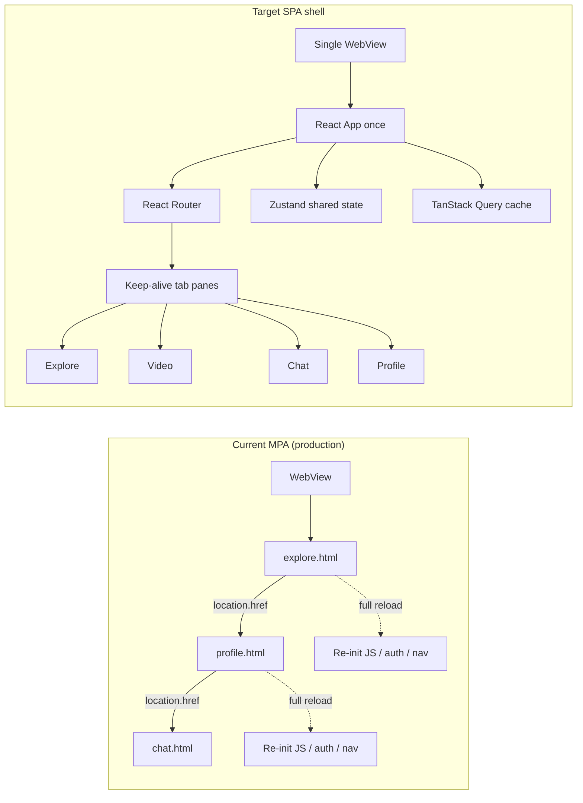

# SPA Migration — AP Services

Branch: `spa-migration` (do not merge to production until cutover is approved).

**Scope:** source-code refactor only. No Play Store, Expo EAS, Android native, package name, signing, AAB/APK, or production WebView URL changes in this phase.

---

## 1. Architecture (old vs new)



**Phase 1 (this commit):** shell + client routing + keep-alive + **legacy HTML embeds** (iframes) so features keep working while screens are ported.

**Later phases:** replace each iframe with a native React screen; then point the WebView at `/spa/` (separate release decision).

---

## 2. Files changed (Phase 1)

| Path | Role |
|------|------|
| `frontend/spa/` | New Vite + React SPA package |
| `frontend/spa/src/main.tsx` | Boot: QueryClient, Router, auth hydrate |
| `frontend/spa/src/router.tsx` | Client routes |
| `frontend/spa/src/layouts/*` | App shell, bottom nav, keep-alive |
| `frontend/spa/src/pages/*` | Tab pages + legacy bridge |
| `frontend/spa/src/stores/*` | Zustand auth / wallet / UI |
| `frontend/spa/src/api/*` | Fetch client + React Query defaults |
| `frontend/spa/SPA_MIGRATION.md` | This document |
| `vercel.json` | Optional `/spa/*` static routes (branch only until merge) |

Production MPA HTML under `frontend/*.html` is **unchanged** and remains the live app entry.

---

## 3. Routing structure

Basename: `/spa`

| Route | Screen | Phase 1 implementation |
|-------|--------|------------------------|
| `/spa/` | → redirect | `/spa/explore` |
| `/spa/explore` | Live / Explore | keep-alive → `explore.html` iframe |
| `/spa/video` | Video | keep-alive → `video.html` iframe |
| `/spa/chat` | Chat | keep-alive → `chat.html` iframe |
| `/spa/profile` | Me | keep-alive → `profile-tab.html` iframe |
| `/spa/rankings` | Rankings | keep-alive → `rankings.html` iframe |
| `/spa/legacy/*` | Unmigrated deep links | one-off iframe bridge |

Bottom nav uses `NavLink` only — **no** `location.href` / full reloads inside the shell.

---

## 4. State management

| Layer | Library | Owns |
|-------|---------|------|
| Session | Zustand `authStore` | user, token (hydrated from `localStorage`) |
| Wallet | Zustand `useWalletStore` | coins, giftCoins, points |
| UI chrome | Zustand `useUiStore` | chat unread badge |
| Server cache | TanStack Query | rooms, `/auth/me`, unread, etc. (stale-while-revalidate) |

Auth and wallet survive tab switches because the shell never unloads. Tab panes stay mounted (hidden), so scroll / iframe document state persist.

---

## 5. Remaining legacy code

Still the live product (and Phase 1 embeds):

- All `frontend/*.html` MPA pages and shared `frontend/*.js` / CSS
- In-page `location.href` navigations **inside** embedded HTML (will be addressed when each screen is ported or via postMessage bridge)
- Expo WebView entry URL still points at MPA (`ap-services-app` untouched)
- Login, live room, gifts, agency, settings, search: not yet native React screens

---

## 6. Performance improvements (Phase 1)

- One shell load; tab switches are show/hide, not document reloads
- Manual chunks: `vendor` (React/Router), `query` (TanStack)
- React Query defaults: `staleTime` 60s, no refetch-on-focus spam
- Prefetch hooks on Explore / Chat / Profile for future native UIs
- Font Awesome loaded non-blocking in SPA `index.html`

---

## 7. Known risks

| Risk | Mitigation |
|------|------------|
| Double chrome (SPA nav + MPA bottom nav in iframe) | Embed with `spa_embed=1`; later hide MPA nav via CSS/JS when that flag is set |
| iframe ↔ parent `localStorage` is same-origin OK; `postMessage` needed for nav intent | Phase 2 bridge |
| Memory: 4–5 keep-alive iframes | Lazy-mount on first visit (implemented); unload policy later if needed |
| Cookie / third-party assumptions in WebView | Same origin as today when served from site root |
| Accidental production cutover | Stay on `spa-migration`; do not change native start URL or push to `main` until ready |

---

## 8. Phase completion estimates

| Phase | Goal | Est. overall % after phase |
|-------|------|----------------------------|
| **1** | Branch, shell, router, stores, Query, keep-alive legacy embeds, docs | **~15%** |
| **2** | Hide dual nav; postMessage nav from embeds; login route in shell | **~30%** |
| **3** | Native Explore + Profile (drop those iframes) | **~50%** |
| **4** | Native Chat list + Rankings; Video keep-alive/hybrid; broader spa_embed bridge | **~70%** |
| 5 | Live room / gifts / agency / settings / search in SPA | ~90% |
| 6 | Remove MPA entry; WebView → `/spa/`; delete dead HTML | **100%** |

**After Phase 4 on this branch: ~65–70% overall.**

### Phase 4 notes

- **Chat:** native conversation list (`GET /messages/conversations`); thread opens legacy `chat.html` with sockets/composer
- **Rankings:** native leaderboards (`GET /v1/leaderboards`)
- **Video:** keep-alive reels player + optional posts grid → fullscreen legacy reel (playback not reimplemented)
- **Bridge:** `ap-spa-embed.js` early boot + `auth-guard.go` uses `spaNavigate` when embedded

### Phase 2 — postMessage bridge

- MPA `social-shell.js`: `spaNavigate()` + click capture when `spa_embed=1`
- SPA: `SpaNavBridge` listens for `{ source: 'ap-spa-embed', type: 'navigate', href }`
- Maps tab HTML → `/explore|/video|/chat|/profile|/rankings`; other pages → `/legacy/...`
- `/spa/login` embeds `app-auth.html` and hydrates token into Zustand

### Phase 3 — native Explore + Profile

- `ExplorePage`: React Query `GET /live/rooms`, Live/Party tabs, Go Live FAB → legacy streamer center / room
- `ProfilePage`: `/auth/me`, `/wallet/balance`, `/social/stats/:id`, menu → SPA legacy bridge
- Room open still uses Agora MPA (`live-room.html` / `party-room.html`) via `/legacy/*` (intentional)

---

## Local development

```bash
cd frontend/spa
npm install
npm run dev
# open http://localhost:5173/spa/
```

Vite serves sibling `frontend/*.html` for legacy iframes and proxies `/api` → `https://api.apservices.in`.

```bash
npm run build   # output: frontend/spa/dist
npm run typecheck
```

## Cutover (later — not now)

1. Merge `spa-migration` when approved  
2. Deploy SPA `dist` under `/spa/`  
3. Change WebView start URL in a **separate** app release (EAS/AAB) — out of scope for this refactor  
4. Keep MPA URLs until analytics confirm SPA stability  

---

## Validation checklist

### Phase 1
- [x] `npm run typecheck` / `npm run build` succeed  
- [x] Tab navigation updates URL without full document reload of the shell  
- [x] Returning to a visited tab keeps state  
- [x] Browser back/forward moves between `/spa/*` routes  
- [x] Token in `localStorage` hydrates `authStore`  
- [x] Production MPA still works unchanged on `main`  

### Phase 2–3
- [ ] From Chat/Video embed, in-page link navigates parent SPA (no iframe-only reload for tabs)
- [ ] Opening a live card from native Explore lands on `/spa/legacy/live-room.html?...`
- [ ] Profile Top Up / menu uses `/spa/legacy/...` without leaving shell
- [ ] `/spa/login` signs in and returns to Explore
- [ ] Live/party immersive routes hide bottom nav  
